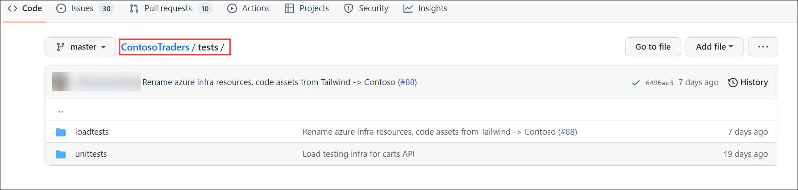

## DevSecOps: L100

# Overview

Contoso Traders are one of the leading E-Commerce platforms with wide range of electronic products like Desktops and Laptops, Mobile Phones, Gaming console accessories and Monitors. This includes a wide range of international brands like Microsoft Surface, XBOX, Samsung, ASUS, DELL etc. Contoso Traders Organization is using Microsoft 365 for their collaboration works internally.

Contoso Traders has different departments like Marketing, Sales, Accounts, HR, IT. For internal communication they are using Microsoft Teams and Outlook. In Contoso Traders Organization, there are various functionalities with the Contoso Traders E-commerce platform like product approval, product price approval, Product price update approval etc. 

# Lab Context

In this lab, you will explore the Contoso traders code base present in a GitHub repository. The repository contains all the files related to the application’s UI, backend APIs, deployment files, GitHub workflows, and deployment guides.

# Hands-On Guide

1.	Open browser, using a new tab navigate to `https://github.com/CloudLabs-AI/ContosoTraders` GitHub repository. You’ll able to visualize multiple files and folders. 

   

2.	Navigate to **github/workflows** folder, it contains the workflow files using which you can the deployment resources. Please find the details of the individual workflow.

    

3.	**Contoso-traders-infra-deployment.yml** will deploy the infrastructure into Azure which includes a resource groups, resources, sets access policies to key vaults, and seeds the database from storage accounts to Azure SQL database.

    

4.	contoso-traders-app-deployment.yml deploys the application to Azure cloud. The application is configured to use the pre-deployed resources.

    

5.	contoso-traders-load-testing.yml configures the load testing on the application.
  
   

6.	The docs folder contains the deployment instruction files which guides you to deploy the infrastructure and application.

   

7.	The iac folders contains the bicep templates which deploys the infrastructure needed for the application.

    

8.	The src folder contains all the source code files related to backend APIs, UI, and other parts of the application.

     

9.	The tests folder contains the files related load testing.

      

1.	From the code tab, scroll down a little and you’ll find the links (1) to access the application. There are different links for test, production UI. You also access the deployment instructions (2) files using the links provided in Documentation paragraph.

     

1.	If you scroll a little bit more, you’ll visualize the entire application infrastructure diagram. The diagram explains how different Azure resources are integrated together and runs in synchronized manner to ensure the working of the application.

     

1.	From the GitHub repository, navigate to Actions (1) tab. You’ll see the different GitHub workflows (2) in the Actions side blade.

     

1.	The contoso-traders-infra-provisioning (1) workflow is configured to deploy the bicep templates which will deploys the whole infrastructure to Azure. To run the workflow, click on Run workflow (2) and select Run workflow (3) to trigger the action.

     

1.	The contoso-traders-app-deployment (1) workflow is configured to deploy the application to Azure cloud. The workflow uses the resources which were deployed from contoso-traders-infra-provisioning workflow. To run the workflow, click on Run workflow (2) and select Run workflow (3) to trigger the action.
  
      

1.	The contoso-traders-load-testing (1) workflow will configure load testing on the application. To run the workflow, click on Run workflow (2) and select Run workflow (3) to trigger the action.

      
