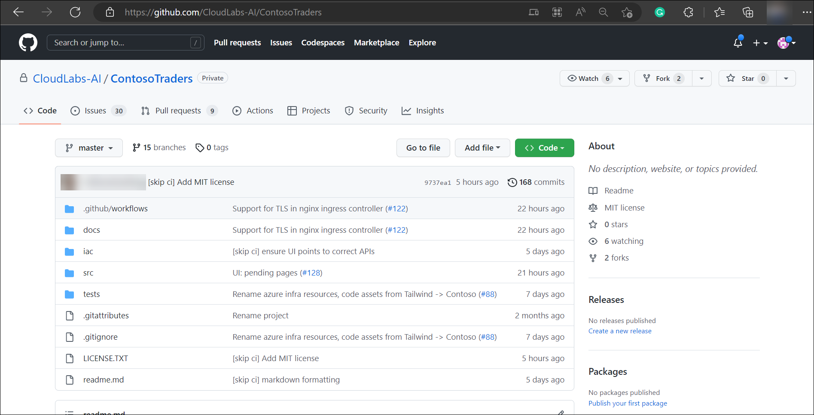
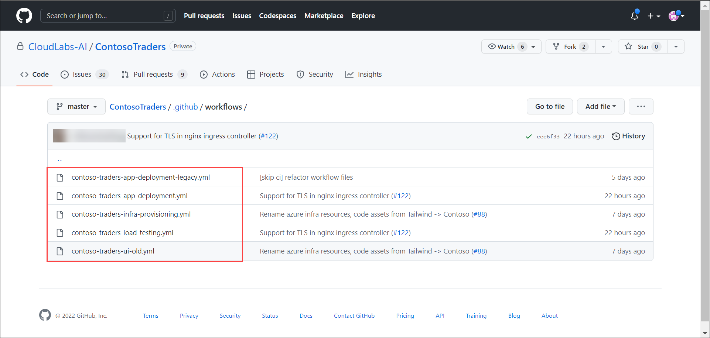
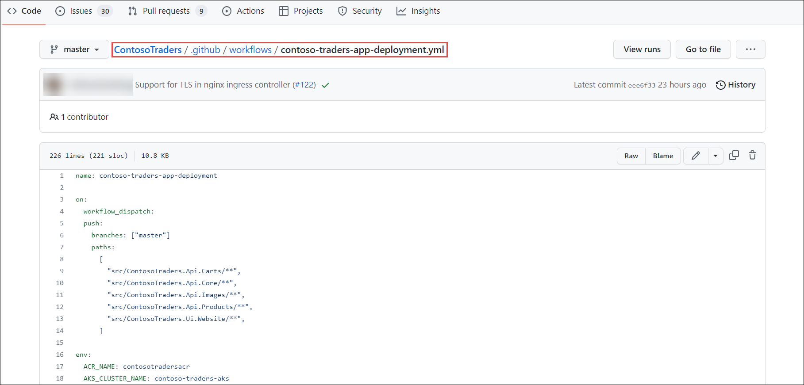
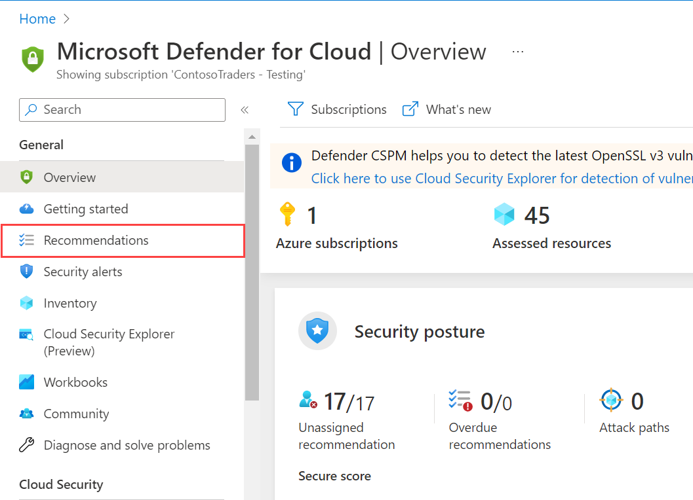

# DevSecOps: L100

## Overview

Contoso Traders is one of the leading E-Commerce platforms with a wide range of electronic products like desktops and laptops, mobile phones, gaming console accessories, and monitors. This includes a wide range of international brands like Microsoft Surface, XBOX, Samsung, ASUS, DELL etc. Contoso Traders Organization is using Microsoft 365 for their collaboration works internally.

Contoso Traders has different departments like marketing, sales, accounts, HR, and IT. For internal communication, they are using Microsoft Teams and Outlook. In the Contoso Traders organisation, there are various functionalities with the Contoso Traders E-commerce platform like product approval, product price approval, Product price update approval etc. 

## Lab Context

From this guide, you will explore the Contoso traders code base present in a GitHub repository which contains all the files related to the application’s UI, backend APIs, deployment files, GitHub workflows, and deployment guides. You will also explore about 

## Hands-On Guide

1. Open browser, using a new tab navigate to `https://github.com/CloudLabs-AI/ContosoTraders` GitHub repository. This repository conatins all the neccessary files and documents which will guide you to host the contoso traders application from the scratch.

     

1. Navigate to **github/workflows** folder, it contains the workflow YAML files using which you can the deployment resources. Please see the individual workflows for more information.

      

1. **Contoso-traders-infra-deployment.yml** will deploy the infrastructure into Azure which includes resource groups, resources, sets access policies to key vaults, and seeds the database from storage accounts into an Azure SQL database.

     

1. **contoso-traders-app-deployment.yml** deploys the application to Azure cloud. The application is configured to use the pre-deployed resources.

     

1. **contoso-traders-load-testing.yml** configures the load testing for the application.
  
    

1. The **docs** folder contains the deployment instruction files, which guide you to deploy the infrastructure and application.

    

1. The **iac** folders contain the BICEP templates, which deploy the infrastructure needed for the application.

     

1. The **src** folder contains all the source code files related to backend APIs, UI, and other parts of the application.

      

1. The **tests** folder contains the files related to load testing.

       

1. From the **code** tab, scroll down a little and you’ll find the **links (1)** to access the application. There are different links for test, production UI. You can also access the **deployment instructions (2)** files using the links provided in the documentation paragraph.

      

1. If you scroll a little bit more, you’ll visualise the entire application infrastructure diagram. The diagram explains how different Azure resources are integrated together and runs in a synchronised manner to ensure the smooth operation of the application.

      

1. From the GitHub repository, navigate to **Actions (1)** tab. You’ll see the different **GitHub workflows (2)** in the Actions sidebar.

      

1. The **contoso-traders-infra-provisioning (1)** workflow is configured to deploy the BICEP templates which will deploy the whole infrastructure to Azure. To run the workflow, click on **Run workflow (2)** and select **Run workflow (3)** to trigger the action.

      

1. The **contoso-traders-app-deployment (1)** workflow is configured to deploy the application to Azure cloud. The workflow uses the resources which were deployed from contoso-traders-infra-provisioning workflow. To run the workflow, click on **Run workflow (2)** and select **Run workflow (3)** to trigger the action.
  
       

1. The **contoso-traders-load-testing (1)** workflow will configure load testing on the application. To run the workflow, click on **Run workflow (2)** and select **Run workflow (3)** to trigger the action.

    
   
1. Navigate to **Settings (1)** tab, select **Code security and analysis (2)** tab. Here, **Dependency graph**, and **Dependabots** are enabled. 

- **The dependency graph** contains all of a repository's dependencies as detailed in the manifest and lock files, or their equivalents, for supported ecosystems, as well as any dependencies submitted via the Dependency Submission API.
   
   - **Dependabot alerts** tell you that your code depends on a package that is insecure or malicious.   

   - **Dependabot security updates** creates  alert for every vulnerable dependency identified in your full dependency graph. However, security updates are triggered only for dependencies that are specified in a manifest or lock file.
   
   
   
1. Now, sign in to your Azure account, where the contoso traders infrastructure is hosted. If the infrastructure is not deployed, please follow the **Deployment setup** documentation.

1. From the Azure portal, search for **Microsoft Defender for cloud (1)** from the search and select **Microsoft Defender for cloud (2)**.

   
   
1. From Microsoft Defender for cloud page, select **Environment settings (1)** tab from the sidebar and click on your **subcription (2)**      
      
   
   
1. In the Settings | Defenders page, you'll be able to see all the resources for which Azure Defender plan is enabled. These are resources which are protected by the Defender plan.
 
   - Azure Defender for cloud finds weak spots across your cloud configuration, helps strengthen the overall security posture of your environment.
   
      
   
1. Navigate back to Microsoft Defender for cloud page, select **Recommendations** from the side blade.

   
   
1. In the Recommendations page, select the **All recommendations (1)** tab. You'll be able to see a bunch of recommendations based on severity. 
 
   - Using the policies, Defender for Cloud periodically analyzes the compliance status of your resources to identify potential security misconfigurations and weaknesses. It then provides you with recommendations on how to remediate those issues. Recommendations are the result of assessing your resources against the relevant policies and identifying resources that aren't meeting your defined requirements.

   
  
1. In the Recommendations page, scroll down a bit and you'll be able to see a set of recommendations for the protected resources and click on any of the recommendation to see the details.

   
  
1. Here, you can see the **Description** of the recommendation, **Remidiation steps** using which you can fix the vulnerability , and **Affected resources**.

    
   
   
## Summary

From this guide, you have understood and got an overview about the Contoso traders GitHub repostory and how you can implement the security between  

    
